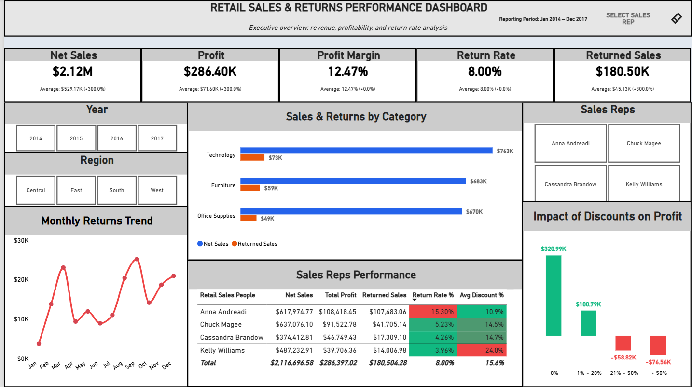
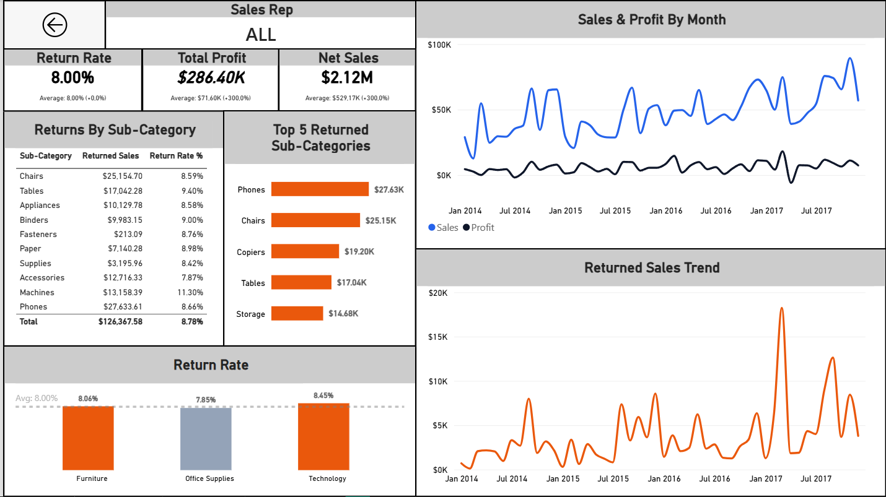
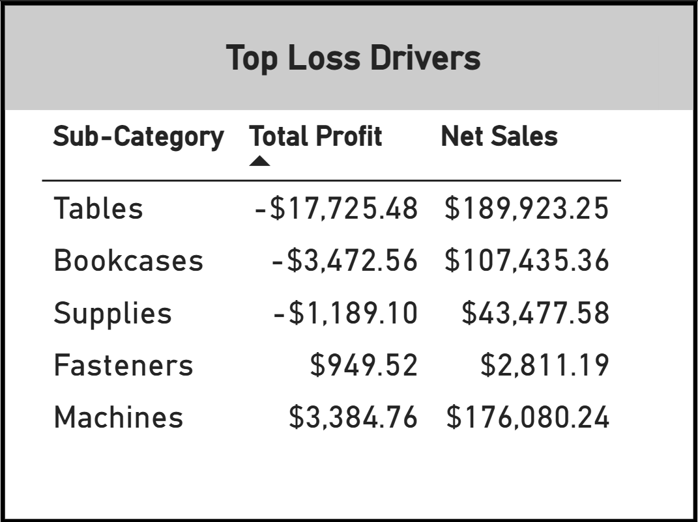

# Retail Sales & Margin Leakage Dashboard (Power BI)

## 📌 Business Overview & Objectives
This project analyzes end-to-end retail performance, operating margins, and return anomalies across regions and sales representatives. The primary business objective is to diagnose **margin leakage**, quantify the financial damage of excessive discount policies, and track performance variances against dynamic enterprise benchmarks.

---

## 📊 Key Business Insights
1. **Aggressive Discount Margin Destruction:** Orders sold at discounts greater than 20% generate severe financial drag, producing cumulative operating losses of -$135.38K (-$58.82K for the 21%–50% bracket and -$76.56K for discounts >50%). Moderate discounting (1%–20%) sustains positive profitability ($100.79K), while full-price sales generate $320.99K in profit.
2. **Sales Rep Return Variance:** The overall enterprise return rate benchmark is **8.00%**, but individual performance varies sharply—ranging from **3.96%** (Kelly Williams) up to **15.30%** (Anna Andreadi), highlighting potential regional quality control issues or misalignment in customer expectations.
3. **Category Return Impact:** While *Technology* drives the highest gross sales volume ($763K), it accounts for **$73K** in returned merchandise. *Office Supplies* follows with $670K sales and $49K returns, and *Furniture* generates $603K sales with $59K returns.

---

## 🖥️ Dashboard Architecture & Views

### 1. Executive Overview
Macro-level enterprise dashboard providing strategic visibility across Net Sales ($2.12M), Profit ($286.40K), Profit Margin (12.47%), Return Rate (8.00%), Returned Sales ($180.50K), and discount-to-profit sensitivity.


### 2. Sales Rep Deep-Dive
Granular operational view featuring dynamic representative benchmarking, month-over-month trend evaluation, and return drivers.


### 3. Interactive Loss-Driver Table Tooltip
Contextual drill-down table tooltip revealing exact negative profit exposure and net sales volume per sub-category (e.g., Tables producing -$17,725.48 loss on $189,923.25 net sales, Bookcases producing -$3,472.56 loss) when hovering over loss-making discount tiers.


---

## 🛠️ Technical Stack & Data Architecture
- **Data Engine:** Power BI Desktop / Analysis Services Tabular Model.
- **Data Modeling:** Star Schema with a custom DAX Date Table ensuring continuous, locale-independent time intelligence.
- **Dynamic Context Handling:** Advanced filter context manipulation using `CALCULATE`, `ALLSELECTED`, `ISFILTERED`, and `HASONEVALUE`.
- **UI/UX Design System:** 
  - Strict semantic coloring (Navy = Revenue, Dark Graphite = Profit, Coral/Red = Returns & Losses).
  - Clean layout free of redundant chart clutter (integrated direct data labels, suppressed secondary X-axes).

---

## 📐 Key DAX Implementations

### 1. Business Logic & Margin Isolation
Differentiating gross order volume from recognized net commercial revenue by isolating returned merchandise:

```dax
Net Sales = 
CALCULATE(
    [Total Sales],
    'Retails Order Full Dataset'[Returned] = "Not"
)

Return Rate % = 
DIVIDE(
    [Returned Items],
    COUNTROWS('Retails Order Full Dataset'),
    0
)
```

### 2. Context-Aware Dynamic Navigation & KPI Subtitles
Adaptive card subtitles computing dynamic deltas against filter-context averages:

```dax
Net Sales Subtitle = 
"Average: " 
    & FORMAT(DIVIDE([Net Sales Avg], 1000), "$#,##0.00") 
    & "K (" & FORMAT([Net Sales vs Avg %], "+0.0%;-0.0%") & ")"

Nav_Salesreps_Text = 
IF(
    ISFILTERED('Retails Order Full Dataset'[Retail Sales People])
        && CALCULATE(HASONEVALUE('Retails Order Full Dataset'[Retail Sales People]), ALLSELECTED('Retails Order Full Dataset')),
    "View " & SELECTEDVALUE('Retails Order Full Dataset'[Retail Sales People]) & "'s Profile",
    "SELECT SALES REP"
)
```

### 3. Dynamic Conditional Formatting Engine
Evaluating visual elements directly against dynamically recalculated partition benchmarks rather than hardcoded thresholds:

```dax
Return_Rate_Color = 
VAR CurrentRate = [Return Rate %]
VAR AvgBenchmark = 
    CALCULATE(
        [Return Rate %],
        ALLSELECTED('Retails Order Full Dataset'[Category])
    )
RETURN
    IF(
        ISBLANK(CurrentRate), 
        BLANK(),
        IF(CurrentRate > AvgBenchmark, "#EA580C", "#94A3B8")
    )
```

### 4. Dynamic Header Multi-Select Concatenation
```dax
Selected Salesrep Name = 
VAR _SelectedCount = COUNTROWS(VALUES('Retails Order Full Dataset'[Retail Sales People]))
VAR _TotalCount = CALCULATE(DISTINCTCOUNT('Retails Order Full Dataset'[Retail Sales People]), ALL('Retails Order Full Dataset'))
RETURN
SWITCH(
    TRUE(),
    _SelectedCount = _TotalCount, "ALL",
    _SelectedCount = 1, SELECTEDVALUE('Retails Order Full Dataset'[Retail Sales People]),
    _SelectedCount <= 2, CONCATENATEX(VALUES('Retails Order Full Dataset'[Retail Sales People]), 'Retails Order Full Dataset'[Retail Sales People], ", "),
    _SelectedCount & " Sales Reps Selected"
)
```

---

## 📂 Repository Structure

```text
├── assets/
│   ├── executive_overview.png
│   ├── sales_rep_details.png
│   └── tooltip_interaction.png
├── dax/
│   ├── 01_core_measures.dax
│   └── 02_conditional_formatting.dax
│
├── data/
│   └── Retail-Supply-Chain-Sales-Dataset.xlsx
├── Retail_Sales_Analytics.pbix
└── README.md
```

---

## 🚀 How to Run Locally
1. Clone the repository:
   ```bash
   git clone https://github.com/jakubkrawczyk0409/retail-sales-powerbi.git
   ```
2. Open `Retail_Sales_Analytics.pbix` with **Power BI Desktop**.
